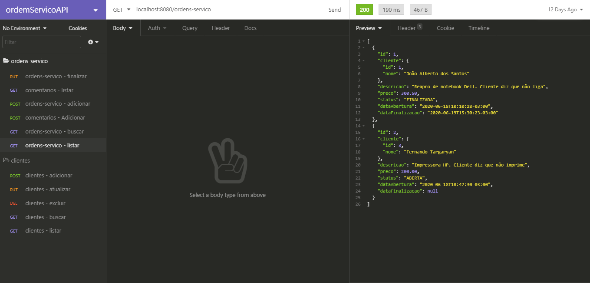

<h2 align="center">Rest API para Ordens de Serviço</h2>

Rest API para ordens de serviços, permitindo abrir, alterar, encerrar e inserir comentários.

O Projeto foi desenvolvido durante o bootcamp <strong>Spring REST</strong> da [Algaworks](https://www.algaworks.com/).


## :dart: Índice
- [Status](#status)
- [Layout](#layout)
- [Tecnologias](#tecnologias)
- [Pré-Requisitos](#pre-requisitos)
- [Executando o projeto](#executando-o-projeto)
- [Licença](#licença)

## :game_die: Status
<p align="center">
  
  
  
  
</p>

## :framed_picture: Layout



## :toolbox: Tecnologias
- [Java](https://docs.oracle.com/javase/8/docs/api/java/lang/ref/Reference.html)
- [Jakarta Persistence](https://jakarta.ee/specifications/persistence/2.2/)
- [Jakarta Bean Validation](https://projects.eclipse.org/proposals/jakarta-bean-validation)
- [Spring Data JPA](https://spring.io/projects/spring-data-jpa)
- [Spring Boot](https://spring.io/projects/spring-boot)
- [Flyway](https://flywaydb.org/)

## :heavy_check_mark: Pré-requisitos
Antes de iniciar, certifique-se que tenha instalado em seu computador as seguintes ferramentas:
- [Spring Tools Suite](https://spring.io/tools#suite-three)
- [MySQL](https://dev.mysql.com/downloads/mysql/)
- [Insomnia](https://insomnia.rest/download/)
- [Git](https://git-scm.com/downloads)

## :gear: Executando o projeto

1. Faça um clone do repositório:

```sh
$ git clone https://github.com/LuizEduardoBilotta/OrdemServicoAPI.git
```
2. Certifique-se que o serviço do `MySQL` esteja rodando em seu computador.

3. Abra o projeto no `Spring Tools Suite`.

4. No `Package Explorer` acesse o diretório `src/main/resources`, e abra o arquivo `application.properties`.

5. Em `spring.datasource.username=` insira o nome de usuário do seu Banco de Dados MySQL.

6. Em `spring.datasource.password=` insira a senha do usuário do seu Banco de Dados MySQL.

7. Execute o projeto, o mesmo criará as tabelas do banco de dados automaticamente através do `Flyway Migration`.

8. Com o projeto em execução, abra o `Insominia` e importe o arquivo `Insomnia_2020-07-01.json` que encontra-se dentro do projeto no diretório `Insomnia_requisitions`.

9. Pronto! Agora é só realizar os testes com as requisições disponíveis.


## :bookmark_tabs: Licença
Este projeto está licenciado nos termos da licença MIT. Veja o arquivo [LICENSE](./LICENSE) para mais detalhes.

## :jigsaw: Contato
- :mailbox_with_mail: E-mail: <a href="mailto:luizeduardobilotta@gmail.com">luizeduardobilotta@gmail.com</a>
- :pushpin: Linkedin: [in/luizeduardobilotta](https://www.linkedin.com/in/luizeduardobilotta)

<sup>Desenvolvido por <i><strong>Luiz Eduardo Bilotta.</i></strong></sup>
